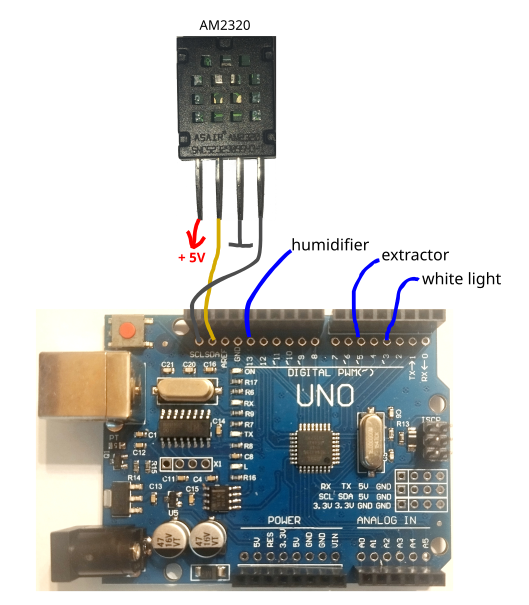

# CNC Growbox [RU](README.ru.md)

It's the first CNC growbox programm for Arduino boards.

## Преимущества

- унифицирована работа с датчиками и исполнительными устройствами, параметризуемый алгоритм управления внутренней средой
- [G-коды](GCODE.md) для параметризации автоматики гроубокса "на лету" либо полного управления с внешнего компьютера.
- 3 вида автоматики, работающих псевдопараллельно:
  - Циклическая с резким переключением периода
  - Циклическая с плавной сменой периода
  - Климат-контроль: значение на исполнительном устройстве удерживается между минимальным и максимальным значением на основании показаний с датчика 
- для ручного управления гроубоксом через компьютер разработано [приложение с графическим интрефейсом](https://github.com/syeysk/sy-cnc-growbox-py).
- [приложение](https://github.com/syeysk/sy-cnc-growbox-py) также имеет API-модуль для разработки кастомных интерфейсов управления.

## Scheme

## Contacts

- Telegram: https://t.me/py_free_developer
- Free news about the projects: https://t.me/syeysk_it

## Inspired by

Very simple
- https://github.com/tinkersprojects/G-Code-Arduino-Library

Interesting (commands, comments):
- https://github.com/tgolla/gcodeparser

Marlin:
- https://github.com/MarlinFirmware/Marlin/tree/bugfix-2.1.x/Marlin/src/gcode
